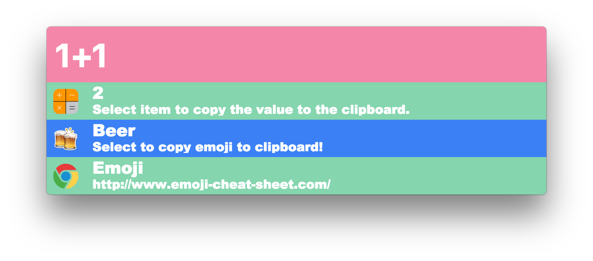

## Playful Theme

A playful theme example written in Post CSS with node/gulp.

[View a demo](http://tinytacoteam.github.io/theme-playbook/#tinytacoteam/playful-theme)

## Installing

Mark `tinytacoteam/playful-theme` inside of your `~/.zazurc.js` file.

~~~ javascript
module.exports = {
  // ...
  'theme': 'tinytacoteam/playful-theme',
  // ...
}
~~~

## Building

~~~
npm install
npm run build
~~~
